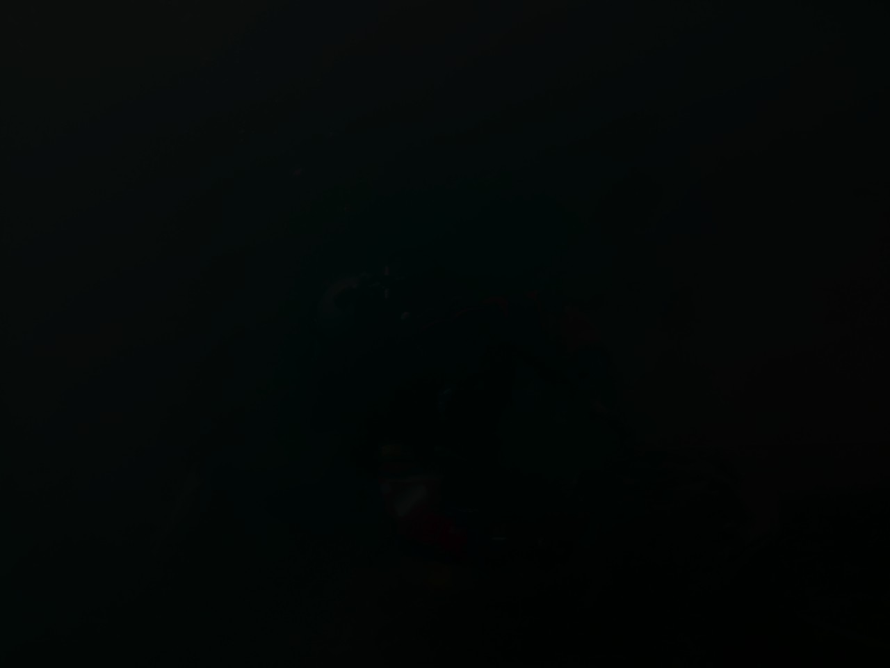
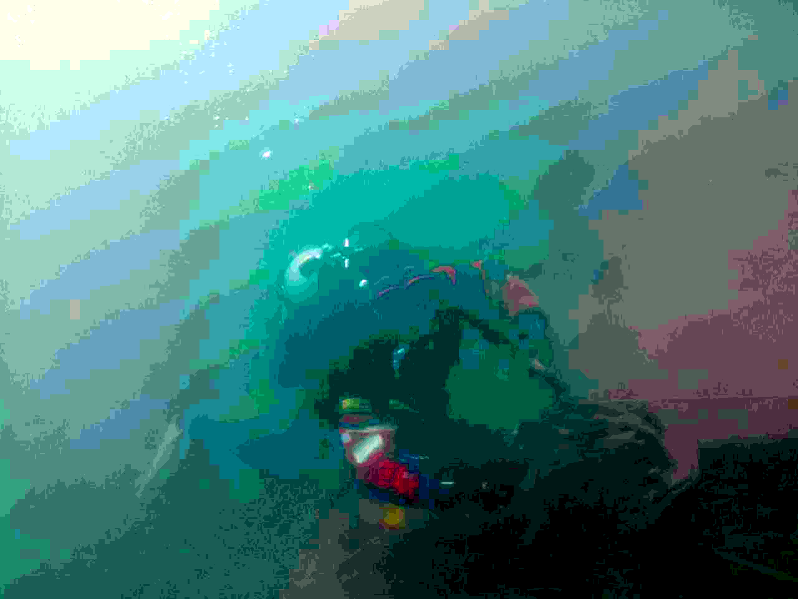
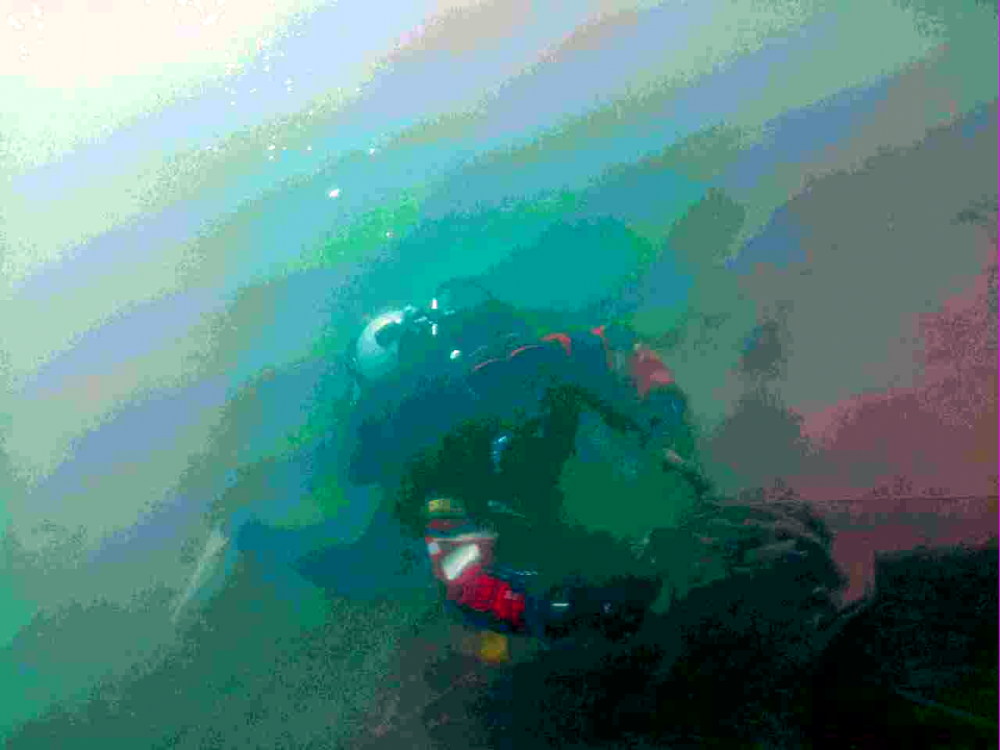
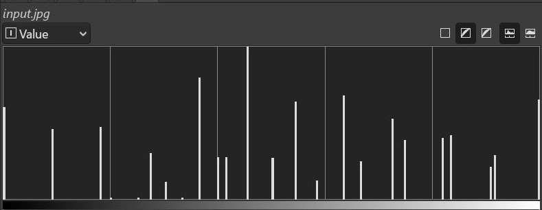
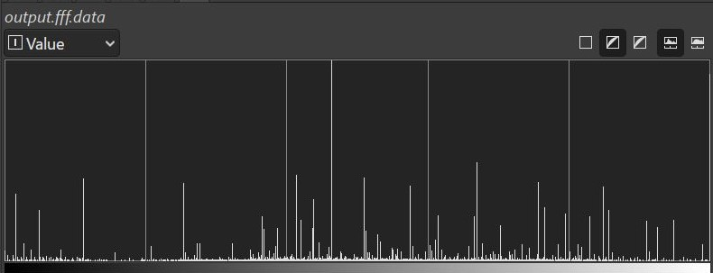
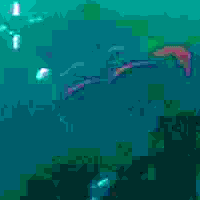
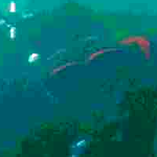

# jFloaty

JPEG -> RGBFFF decoder with reduced rounding

## Demo

This is a picture of my friend Russ on a JetSki, but horribly underexposed.

Lets fix it with 'auto input level' feature in GIMP.
But when we do so, the JPEG decoder has rounding error.
jFloaty is a patch to STB-Image that decodes JPEGs direct to float-32.

|          |      GIMP Alone | jFloaty+GIMP  | Notes |
|:--------:|:----------------------------------------:|:-------------------------------------------------------:|:-:|
|Image     |  |                | There are more colors available. The banding is improved. |
|Histogram |    |                  | Evidence of more colors |
|Zoomed    |  |                  | Zoomed detail of face |
