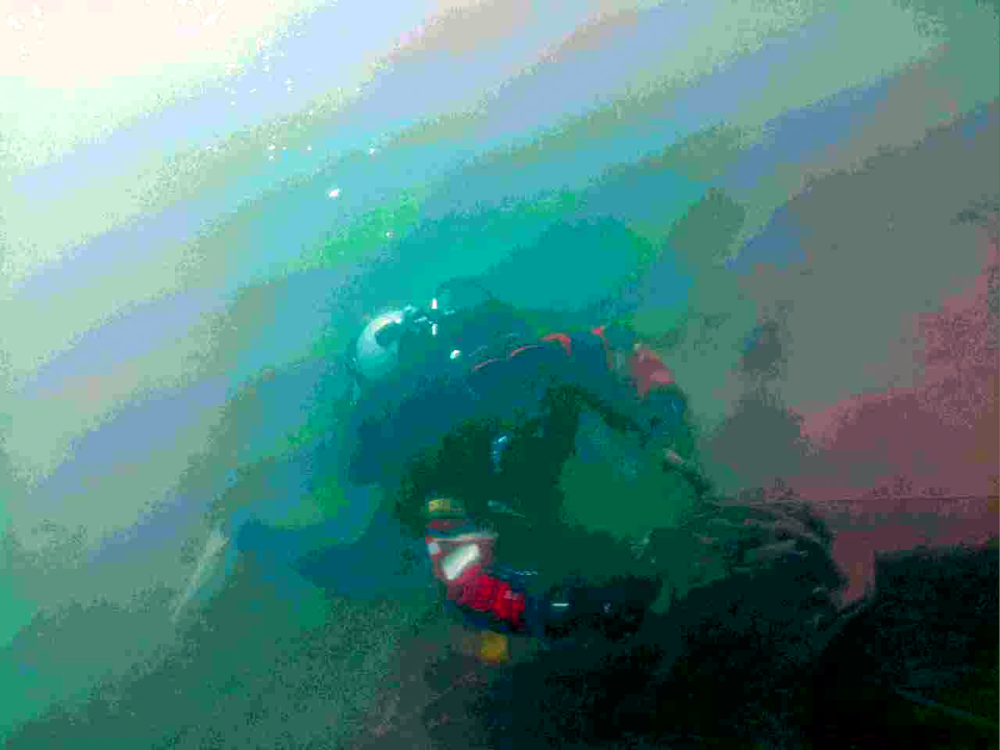
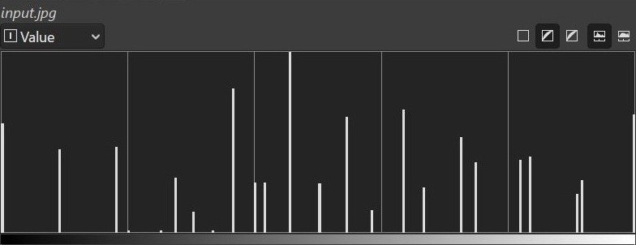
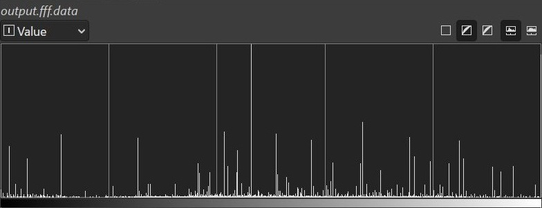
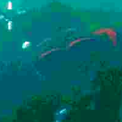

# jFloaty

jFloaty is a JPEG codec with reduced rounding. It's a fork of STB-Image and STB-Image-Write with floating-point pixels, and a demonstator executable.

## Demo

This is a picture of my friend Russ on a JetSki, but intentionally underexposed.

Lets fix it with 'auto input level' feature in GIMP.
But when we do so, the JPEG decoder has rounding error.
jFloaty is a patch to STB-Image that decodes JPEGs direct to float-32.

|          |      GIMP Alone | jFloaty+GIMP  | Notes |
|:--------:|:----------------------------------------:|:-------------------------------------------------------:|:-:|
|Image     |  |                | There are more colors available. The banding is improved. |
|Histogram |    |                  | Evidence of more colors |
|Zoomed    |  |                  | Zoomed detail of face |

# DSP Thoughts

## Quick Review of JPEG:

### Encoding:

1. RGB -> YUV
1. optional: subsample U & V
1. DCT(YUV) -> bins
1. zero high frequency bins, zigzag, and quantize 
1. huffman encode bins

### Decoding:

1. huffman decode bins
1. dequantize bins
1. Invert-DCT(bins) -> YUV
1. resample U & V if needed
1. YUV -> RGB

## Thoughts and comparison between STB-Image and jFloaty

* Encoding
  * If your camera shoots raw, just start with that rather than rewiting a JPEG codec for a handful of bits of banding reduction
  * Input pixels
    * STB-Image already uses floats for everything other than the 8-bit input pixels.
    * jFloaty input pixels are 32-bit floats, which can give slightly more accurate DCT values for the MCU(macroblock). However, quantization means the total effect of 32-bit input may only mean picking a better quanta sometimes. 
* Decoding
  * Inverse-DCT
    * STB-image's iDCT is in fixed-point with up-shifting and rounding. jFloaty uses floats.
    * The main difference here isn't rounding in the intermediate computation, it's that jFloaty's iDCT outputs floats.
  * Resampling
    * STB-Image resamples 8-bit values to 8-bit, but for YUV420 would need up to 10 bits for the result.
    * With 32-bit floats, jFloaty's resampler can reduce rounding error by 1-2 bits compared to STB-Image. 
  * YUV2RGB
    * RGB888 has ~16 million distinct colors
    * STB-Image's YUV888->RGB888 maps to ~4.7 million colors, so only ~28% of the RGB888 colors are reachable.
    * Patching STB-Image's YUV888->RGBFFF maps to ~10.3 million colors. Many these would've rounded to the same RGB888 integer tuples, and doesn't mean we're reaching more unique RGB88 values.
    * With 32-bit YUV input, we get many more shades.
