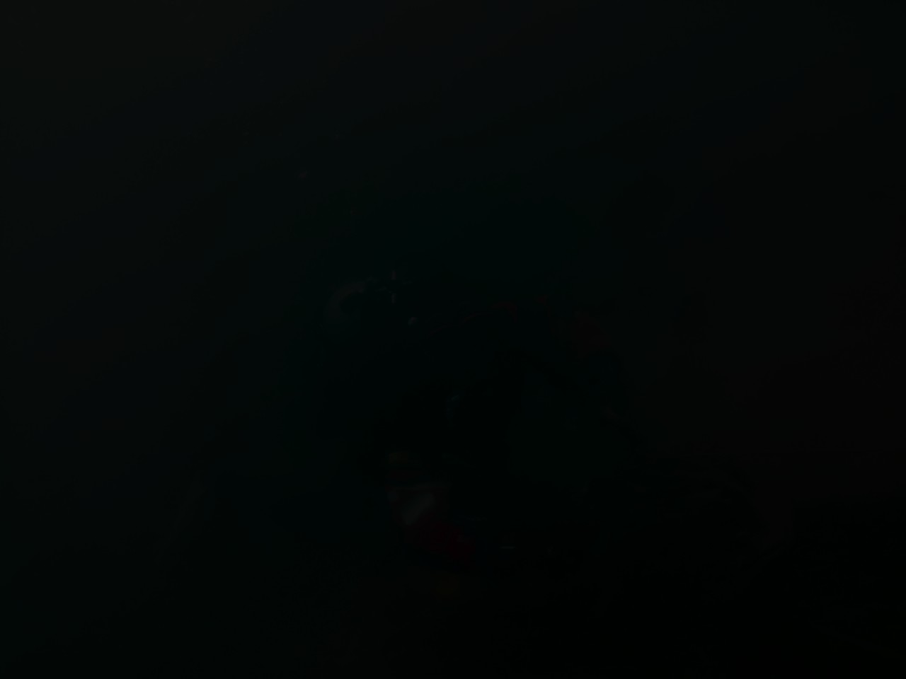
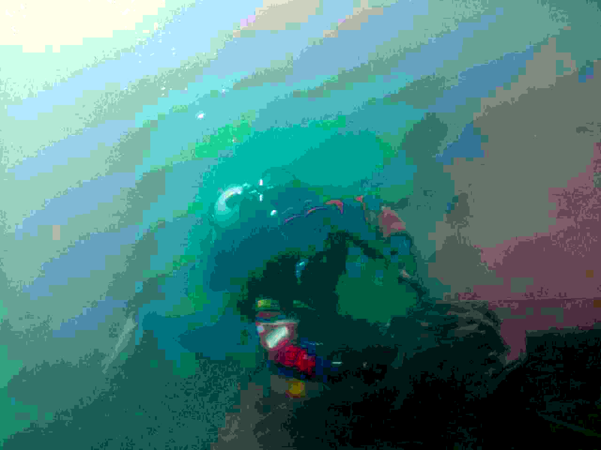
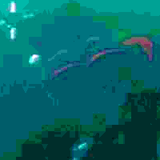
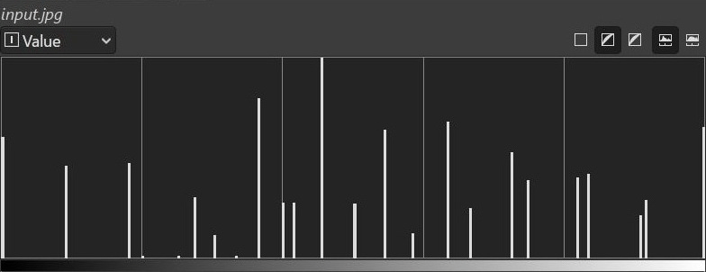
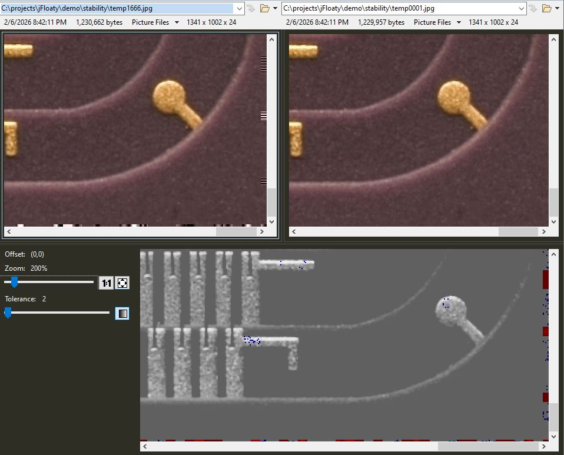

# jFloaty

jFloaty is a JPEG codec with reduced rounding. It's a fork of STB-Image and STB-Image-Write with floating-point pixels, and a demonstator executable.

## Demo

This is a picture of my friend Russ on a JetSki, but intentionally underexposed.

Lets fix it with 'auto input level' feature in GIMP.
But when we do so, the JPEG decoder has rounding error and causes a lot of banding.
jFloaty is a hack within STB-Image that decodes JPEGs directly to float-32 pixels
without integer quantization(16 million RGB888 colors is oddly not always enough),
and also supports encoding float-32 pixels directly into JPEGs as well. Comparisons:

(the blockier one is the "before")

Detail of Russ's mask:

Histograms:

# DSP Thoughts

## Quick Review of JPEG:

### Encoding:

1. RGB -> YUV
1. optional: subsample U & V
1. DCT(YUV) -> bins
1. zero high frequency bins, zigzag, and quantize 
1. huffman encode bins

### Decoding:

1. huffman decode bins
1. dequantize bins
1. Invert-DCT(bins) -> YUV
1. resample U & V if needed
1. YUV -> RGB

## Thoughts and comparison between STB-Image and jFloaty

* Encoding
  * If your camera shoots raw, just start with that rather than rewiting a JPEG codec for a handful of bits of banding reduction
  * Input pixels
    * STB-Image already uses floats for everything other than the 8-bit input pixels.
    * jFloaty input pixels are 32-bit floats, which can give slightly more accurate DCT values for the MCU(macroblock). However, quantization means the total effect of 32-bit input may only mean picking a better quanta sometimes. 
* Decoding
  * Inverse-DCT
    * STB-image's iDCT is in fixed-point with up-shifting and rounding. jFloaty uses floats.
    * The main difference here isn't rounding in the intermediate computation, it's that jFloaty's iDCT outputs floats.
  * Resampling
    * STB-Image resamples 8-bit values to 8-bit, but for YUV420 would need up to 10 bits for the result.
    * With 32-bit floats, jFloaty's resampler can reduce rounding error by 1-2 bits compared to STB-Image. 
  * YUV2RGB
    * RGB888 has ~16 million distinct colors
    * STB-Image's YUV888->RGB888 maps to ~4.7 million colors, so only ~28% of the RGB888 colors are reachable.
    * Patching STB-Image's YUV888->RGBFFF maps to ~10.3 million colors. Many these would've rounded to the same RGB888 integer tuples, and doesn't mean we're reaching more unique RGB88 values.
    * With 32-bit YUV input, we get many more shades.

# What happens if we recompress a JPEG infinitely many times?

This is really zoomed in on the bottom-right corner.
The blue speckles are decoder differences within 2/255 digital codes. There are low-amplitude differences all over differences between the first few codec trips.
The red speckles are much larger differences, that only occur on the right and bottom edges.

* The sparse blue differences all over the image settle out within 4 trips through the codec.
* On the rightmost edge you can see MCU(macroblock) boundaries. These take many more trips through the codec to reach stability, and are visibly disturbed when they do. This image isn't divisible into 8x8 MCUs, so those partially filled border MCUs continue to lose data every trip until there's only some very basic DCT coefficients left.
* Temp1667 and beyond are byte-wise identical to Temp1666.
